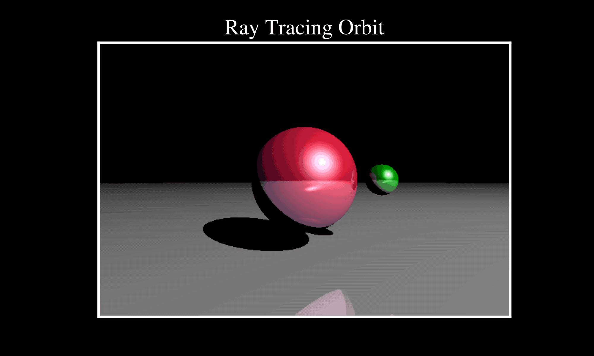

# PyRayTrace

A simple script to animate a ray traced scene using python. This code was adapted from the extremely helpful <a href="https://medium.com/swlh/ray-tracing-from-scratch-in-python-41670e6a96f9">Medium Post</a> written by Omar Aflak. It is worth a 10 minute read to understand the basics of Ray Tracing. I adapted this code to be object oriented and include animation features.

Dependencies:
  * `numpy`
  * `matplotlib`
  * `tqdm`

To run the code just run the following command from inside the repo:

`python raytrace.py`

You can modify the initial conditions, resolution, and other physical parameters to your liking. Running the base file should get you something that looks like this:

