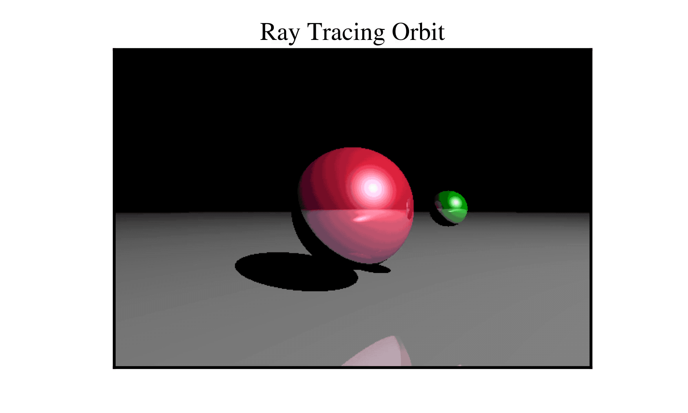

# Running the Code

To run the code just run the following command from inside the repo

```
python raytrace.py
```

You can modify the initial conditions, resolution, and other physical parameters to your liking. Running the base file should get you something that looks like this:


